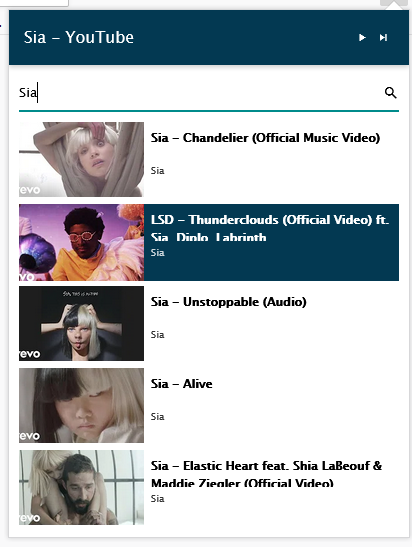

# youtube-remote
A Firefox Add-on to control a youtube tab.  
If you have several Youtube tabs, it controls the first one.

## Features

- [x] Play
- [ ] Volume control
- [x] Next
- [x] Search

## Test the plugin

Open firefox and follow these steps:
- Go on url `about:debugging#/runtime/this-firefox`
- Click on `Load Temporary Add-on`
- Select an Add-on file (for example `manifest.json`)

## Troubleshooting
If the video does not start, allow the autoplay:  

## Icons
Youtube icon made by [Freepik](https://www.freepik.com/) from [Flaticon](www.flaticon.com)  
