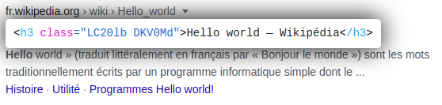

# Dom Element Display
  
A Firefox Add-on to inspect element at mouse position by pressing `alt+shift+i`.  

## Test the plugin

Open firefox and follow these steps:
- Go on url `about:debugging#/runtime/this-firefox`
- Click on `Load Temporary Add-on`
- Select an Add-on file (for example `manifest.json`)

## Icons
Programming icon made by [Freepik](https://www.freepik.com/) from [Flaticon](www.flaticon.com)

